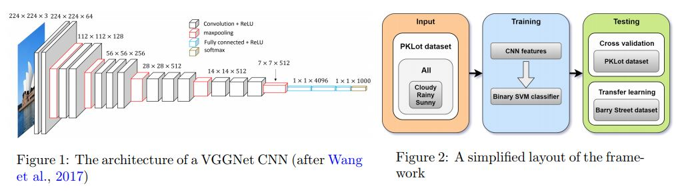
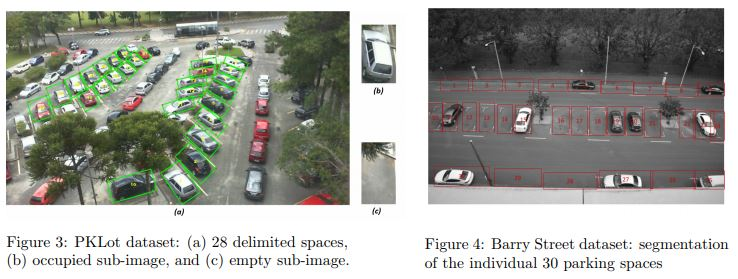

# Real-time parking lot occupancy detection using Deep Learning

TensorFlow and Keras implementation of [Real-time image-based parking occupancy detection using deep learning, Acharya, D., Yan, W., &amp; Khoshelham, K. 2018](http://ceur-ws.org/Vol-2087/paper5.pdf) work.

The authors implemented the model using pre-trained VGG network and Support Vector Machines (SVM). VGG network used for feature extractions and SVM used for classificaition. Authors used PKLot dataset for model training and evaluated the model on custom dataset created by authors.

I exprimented with different models for featre extraction and classification. SVM model with ResNet-50 feature extractor gave better performance of average f1-score compared to all other models. PKLot dataset is used to train and evaluate the model. UFPR04 and UFPR05 parking lot data used for training and PUC parking lot data used for validation. Please find the model metrics in the respective notebooks.

Implemented using,
- TensorFlow
- Keras
- scikit-learn

## Notebooks
Following are the notebooks you can find in the repo,
- Dataset creation - [create_dataset_index.ipynb](create_dataset_index.ipynb) Note: 
- CNN models
  - ResNet50 - [cnn_models_resnet50.ipynb](cnn_models_resnet50.ipynb)
  - VGG16 - [cnn_models_vgg16.ipynb](cnn_models_vgg16.ipynb)
  - CNN from scratch - [cnn_models_from_scratch.ipynb](cnn_models_from_scratch.ipynb)
- CNN with SVM
  - ResNet50 + SVM - [resnet50_linear_svm_model.ipynb](resnet50_linear_svm_model.ipynb)
  - VGG16 + SVM - [vgg16_linear_svm_model.ipynb](vgg16_linear_svm_model.ipynb)

## Model framework

## Dataset

PKLot dataset - https://web.inf.ufpr.br/vri/databases/parking-lot-database/

